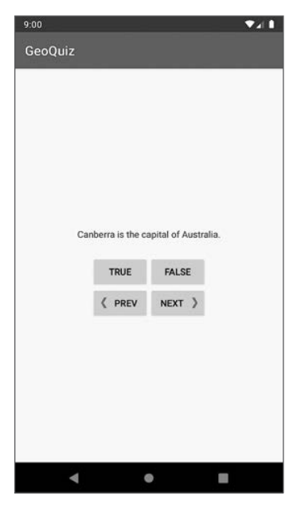
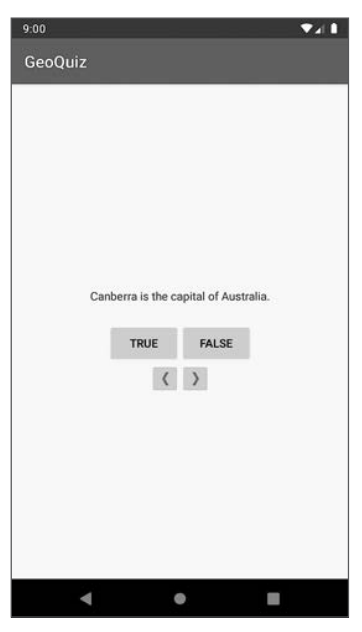
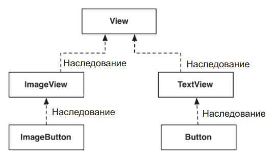
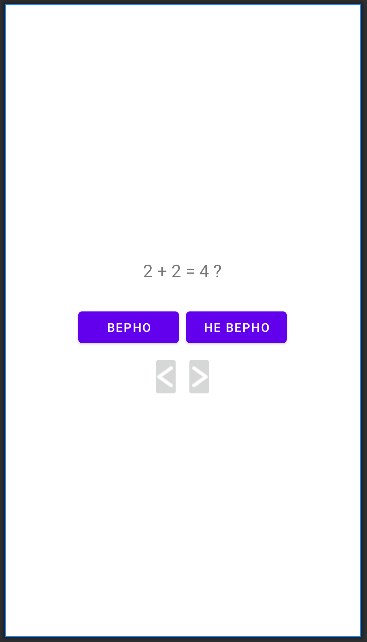

<p align = "center">МИНИСТЕРСТВО НАУКИ И ВЫСШЕГО ОБРАЗОВАНИЯ
РОССИЙСКОЙ ФЕДЕРАЦИИ
ФЕДЕРАЛЬНОЕ ГОСУДАРСТВЕННОЕ БЮДЖЕТНОЕ
ОБРАЗОВАТЕЛЬНОЕ УЧРЕЖДЕНИЕ ВЫСШЕГО ОБРАЗОВАНИЯ
«САХАЛИНСКИЙ ГОСУДАРСТВЕННЫЙ УНИВЕРСИТЕТ»</p>
<br><br><br><br><br><br>
<p align = "center">Институт естественных наук и техносферной безопасности<br>Кафедра информатики<br>Хроменков Владимир Александрович</p>
<br><br><br>
<p align = "center">Лабораторная работа №2<br>«Разработка мобильных приложений»<br>01.03.02 Прикладная математика и информатика</p>
<br><br><br><br><br><br><br><br><br><br><br><br>
<p align = "right">Научный руководитель<br>
Соболев Евгений Игоревич</p>
<br><br><br>
<p align = "center">г. Южно-Сахалинск<br>2023 г.</p>

***
# <p align = "center">Оглавление</p>
- [Цели и задачи](#цели-и-задачи)
- [Решение задач](#решение-задач)
    - [TextView](#textView)
    - [ImageButton](#imageButton)
- [Вывод](#вывод)

***

# <p align = "center">Цели и задачи</p>

1.  Добавление слушателя для `TextView`.
Кнопка NEXT удобна, но было бы неплохо, если бы пользователь мог переходить к следующему вопросу простым нажатием на виджет TextView. 
`Подсказка.` Для TextView можно использовать слушателя View.OnClickListener, который использовался с Button, потому что класс TextView также является производ
 
2.	Добавление кнопки возврата
Добавьте кнопку для возвращения к предыдущему вопросу. Пользовательский интерфейс должен выглядеть примерно так, как показано на рис. 2.13. 

<p align = "center">

рис. 2.13
</p>

3.	От Button к ImageButton 
Возможно, пользовательский интерфейс будет смотреться еще лучше, если на кнопках будут отображаться только значки, как на рис. 2.14.
Для этого оба виджета должны относиться к типу ImageButton (вместо обычного Button). Виджет ImageButton является производным от ImageView, в отличие от виджета Button, производного от TextView. Диаграммы их наследования изображены на рис. 2.15. 
Атрибуты text и drawable кнопки NEXT можно заменить одним атрибутом ImageView:

```kotlin

<Button ImageButton
 android:id="@+id/next_button"
 android:layout_width="wrap_content"
 android:layout_height="wrap_content"
 //android:text="@string/next_button"
 //android:drawableEnd="@drawable/arrow_right"
 //android:drawablePadding="4dp"
 android:src="@drawable/arrow_right"/>

```

<p align = "center">

рис. 2.14


рис. 2.15
</p>

Конечно, вам также придется внести изменения в MainActivity, чтобы этот класс работал с ImageButton. После того как вы замените эти кнопки на кнопки ImageButton, Android Studio выдаст предупреждение об отсутствии атрибута android:contentDescription. Этот атрибут обеспечивает доступность контента для читателей с ослабленным зрением. Строка, заданная этому атрибуту, читается экранным диктором (при включении соответствующих настроек в системе пользователя). Наконец, добавьте атрибут android:contentDescription в каждый элемент ImageButton.

***

# <p align = "center">Решение задач</p>

## TextView

```kotlin
...
class MainActivity : AppCompatActivity() {
  private lateinit var questionTextView: TextView;
  private lateinit var toast:Toast
  
  private var currentindex = 0;
  private val questionBank = listOf(
    Question(R.string.question_0, true),
    Question(R.string.question_1, true),
    Question(R.string.question_2, false),
    Question(R.string.question_3, true),
    Question(R.string.question_4, false),
    Question(R.string.question_5, false),
  );
  
  override fun onCreate(savedInstanceState: Bundle?) {
    ...
    questionTextView.setOnClickListener(){
      showToast(R.string.next_toast)
      nextQuestion();
    }
  }
  
  private fun showToast(text: Int){
    toast = Toast.makeText(this, text, Toast.LENGTH_SHORT);
    //toast.setGravity(Gravity.TOP, 0, 0);
    toast.show();
  }
  
  private fun nextQuestion(){
    currentindex++;
    if(currentindex == questionBank.size) currentindex = questionBank.size - 1;

    val questionTextResId = questionBank[currentindex].textResId;
    questionTextView.setText(questionTextResId);
  }
}
```

## ImageButton
### ! Объеденил задания 2 и 3.

```xml
<?xml version="1.0" encoding="utf-8"?>
<LinearLayout xmlns:android="http://schemas.android.com/apk/res/android"
    xmlns:app="http://schemas.android.com/apk/res-auto"
    xmlns:tools="http://schemas.android.com/tools"
    android:layout_width="match_parent"
    android:layout_height="match_parent"
    android:gravity="center"
    android:orientation="vertical"
    tools:context=".MainActivity">

    <TextView
        android:id="@+id/question_text"
        android:layout_width="wrap_content"
        android:layout_height="wrap_content"
        android:text="@string/question_0"
        android:textSize="20dp"
        android:padding="24dp" />

    <LinearLayout
        android:layout_width="wrap_content"
        android:layout_height="wrap_content"
        android:orientation="horizontal">

        <Button
            android:id="@+id/true_button"
            android:layout_width="50pt"
            android:layout_height="wrap_content"
            android:layout_margin="4dp"
            android:text="@string/true_button" />

        <Button
            android:id="@+id/false_button"
            android:layout_width="50pt"
            android:layout_height="wrap_content"
            android:layout_margin="4dp"
            android:text="@string/false_button" />

    </LinearLayout>

    <LinearLayout
        android:layout_width="wrap_content"
        android:layout_height="wrap_content"
        android:orientation="horizontal">

        <ImageButton
            android:id="@+id/previos_button"
            android:layout_width="30dp"
            android:layout_height="50dp"
            android:layout_margin="4dp"
            android:src="@drawable/arrow_left"
            android:contentDescription="@string/previos_button" />

        <ImageButton
            android:id="@+id/next_button"
            android:layout_width="30dp"
            android:layout_height="50dp"
            android:layout_margin="4dp"
            android:src="@drawable/arrow_rigth"
            android:contentDescription="@string/next_button" />

    </LinearLayout>

</LinearLayout>
```

```kotlin
package com.zfginc.geoquize

import androidx.appcompat.app.AppCompatActivity
import android.os.Bundle
import android.view.Gravity
import android.widget.Button
import android.widget.ImageButton
import android.widget.TextView
import android.widget.Toast
import org.w3c.dom.Text

class MainActivity : AppCompatActivity() {

    private lateinit var true_button:Button;
    private lateinit var false_button:Button;

    private lateinit var next_button:ImageButton;
    private lateinit var previos_button:ImageButton;

    private lateinit var questionTextView: TextView;
    private lateinit var toast:Toast

    private var currentindex = 0;
    private val questionBank = listOf(
        Question(R.string.question_0, true),
        Question(R.string.question_1, true),
        Question(R.string.question_2, false),
        Question(R.string.question_3, true),
        Question(R.string.question_4, false),
        Question(R.string.question_5, false),
    );

    override fun onCreate(savedInstanceState: Bundle?) {
        super.onCreate(savedInstanceState)
        setContentView(R.layout.activity_main)

        true_button = findViewById(R.id.true_button);
        false_button = findViewById(R.id.false_button);
        next_button = findViewById(R.id.next_button);
        previos_button = findViewById(R.id.previos_button);
        questionTextView = findViewById(R.id.question_text);

        true_button.setOnClickListener(){
            if(questionBank[currentindex].answer == true) {
                showToast(R.string.currect_toast);
                nextQuestion();
            }
            else{
                showToast(R.string.incurrect_toast);
            }
        }
        false_button.setOnClickListener(){
            if(questionBank[currentindex].answer == false) {
                showToast(R.string.currect_toast);
                nextQuestion();
            }
            else{
                showToast(R.string.incurrect_toast);
            }
        }

        next_button.setOnClickListener(){
            nextQuestion();
        }
        previos_button.setOnClickListener(){
            previosQuestion();
        }

        questionTextView.setOnClickListener(){
            showToast(R.string.next_toast)
            nextQuestion();
        }

        val questionTextResId = questionBank[currentindex].textResId
        questionTextView.setText(questionTextResId)
    }

    private fun showToast(text: Int){
        toast = Toast.makeText(this, text, Toast.LENGTH_SHORT);
        //toast.setGravity(Gravity.TOP, 0, 0);
        toast.show();
    }

    private fun nextQuestion(){
        currentindex++;
        if(currentindex == questionBank.size) currentindex = questionBank.size - 1;

        val questionTextResId = questionBank[currentindex].textResId;
        questionTextView.setText(questionTextResId);
    }

    private fun previosQuestion(){
        currentindex--;
        if(currentindex < 0) currentindex = 0;

        val questionTextResId = questionBank[currentindex].textResId;
        questionTextView.setText(questionTextResId);
    }
}
```

### ! Исправил зацикливание вопросов на кнопки переходов !
До:
```kotlin
private fun nextQuestion(){
    currentindex = (currentindex + 1) % questionBank.size;

    val questionTextResId = questionBank[currentindex].textResId;
    questionTextView.setText(questionTextResId);
}

private fun previosQuestion(){
    currentindex = (currentindex - 1) % questionBank.size;

    val questionTextResId = questionBank[currentindex].textResId;
    questionTextView.setText(questionTextResId);
}
```

После:
```kotlin
private fun nextQuestion(){
    currentindex++;
    if(currentindex == questionBank.size) currentindex = questionBank.size - 1;

    val questionTextResId = questionBank[currentindex].textResId;
    questionTextView.setText(questionTextResId);
}

private fun previosQuestion(){
    currentindex--;
    if(currentindex < 0) currentindex = 0;

    val questionTextResId = questionBank[currentindex].textResId;
    questionTextView.setText(questionTextResId);
}
```

<p align = "center">

рис. 2.16
</p>

### ! Так же повысил minSdkVersion с 19 до 21!

***

# <p align = "center">Вывод</p>

Выполнил *лабораторную работу №2*, совершенствую навыки работы с языком `Kotlin`. 
